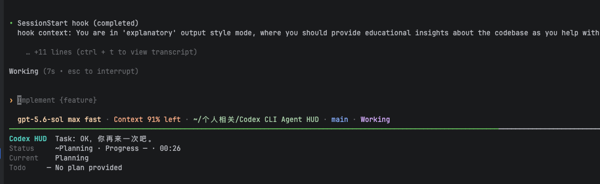
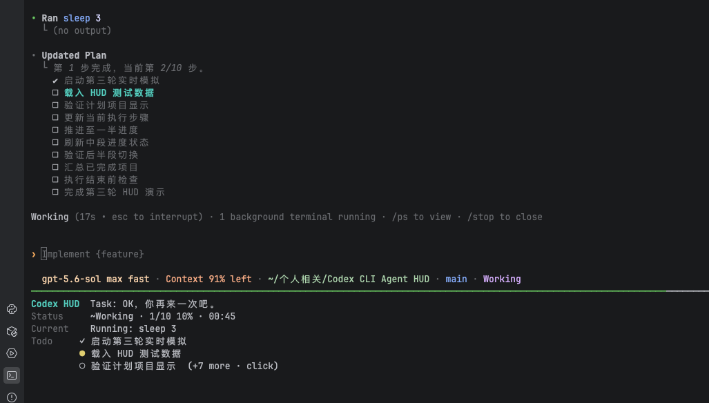
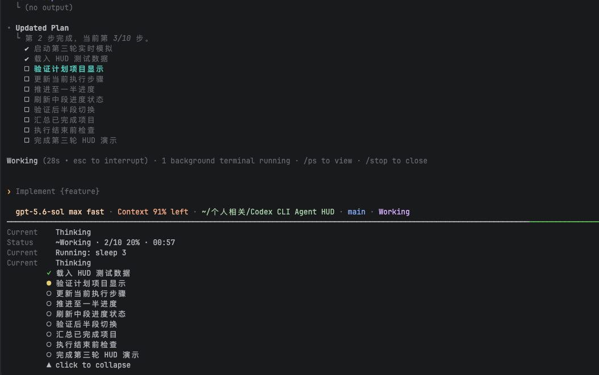
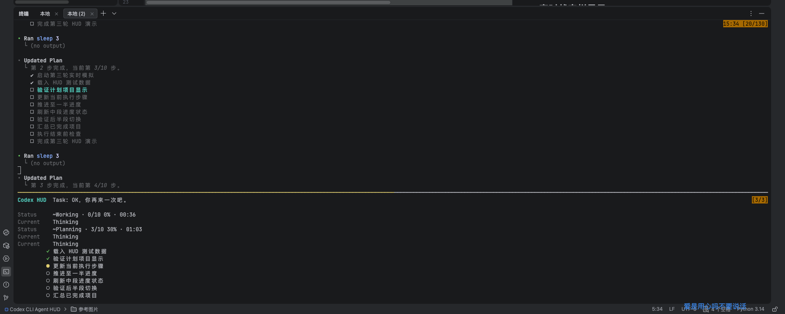

# Codex CLI Agent HUD

让 Codex CLI 在运行过程中始终拥有一个可见、可交互的底部状态面板。

完成一次安装后，日常使用方式仍然是直接输入 `codex`。交互式会话会自动进入 HUD，脚本、管道和非交互子命令则继续调用原始 Codex CLI。

HUD 持续展示当前任务、运行阶段、完成比例、正在执行的动作和 Todo，不需要修改 Codex 源码，也不会解析不稳定的终端画面。

## 运行效果

### 自动显示在 Codex 下方



### 实时任务、进度与当前动作



### 点击展开完整 Todo



### PyCharm Terminal 完整运行效果



## 核心能力

- **直接运行 `codex`**：安装后的交互入口自动启动 HUD，不需要记忆另一条启动命令。
- **始终位于终端底部**：Codex 保持在上方，HUD 使用独立区域持续显示状态。
- **真实计划进度**：Todo 和百分比来自 Codex 的 `update_plan`，不会根据文本猜测进度。
- **可点击 Todo**：收起时保留关键步骤，点击后展开完整列表，再次点击即可收起。
- **稳定滚动历史**：鼠标滚轮进入 tmux copy-mode，可以回看当前 Codex 会话输出；拖选、松开或单击不会自动回到最新输出。
- **PyCharm 双模式复制**：仅在 HUD 自己创建的隔离 tmux 内，为 PyCharm / JetBrains Terminal 提供可点击的“复制模式”和“HUD 模式”；复制仍由 PyCharm 原生选区和 `⌘C` 完成。
- **兼顾嵌入式终端**：针对 JetBrains Terminal 的运行中闪烁启用动画抑制和同步帧输出。
- **低侵入、可回滚**：Hooks 和 shell 入口都带有明确归属标记，卸载时只删除本项目写入的内容。
- **本地与脱敏**：不上传运行状态，不保存完整 transcript、工具输出或模型推理。

## 实现方式

```text
codex
  └─ zsh 交互入口（只路由交互式调用）
       └─ tmux
           ├─ 上方 pane：原始 Codex CLI
           │    └─ 原生状态行：模型 / Context / 目录 / Git / run-state
           └─ 下方 pane：Codex HUD
                └─ Task / Phase / Progress / Current / Todo

Codex Hooks → 脱敏事件 → 状态归约 → HUD Renderer
```

Codex 官方 Hooks 提供结构化生命周期事件，`tmux` 为原始 Codex TUI 和 HUD 分配独立区域。HUD 不解析屏幕输出，也不读取不稳定的 transcript；进度按 `completed / total` 精确计算。

## 运行环境

- macOS
- Node.js 20 或更高版本
- Codex CLI 0.146.0 或兼容版本
- tmux

终端兼容目标包括：

- Apple Terminal（HUD 与标准 tmux 滚动；不显示 PyCharm 双模式按钮）
- PyCharm / IntelliJ 内置 Terminal（双模式按钮仅限下文的隔离 HUD 条件）
- VS Code 内置 Terminal（HUD 与标准 tmux 滚动；不显示 PyCharm 双模式按钮）
- iTerm2、Warp、WezTerm、Alacritty、Kitty 等兼容 xterm 的 macOS 终端

自动测试通过真实 PTY/tmux 验证 pane、鼠标绑定、scrollback、动态 resize 和退出码；并不等同于所有 GUI 终端版本都经过人工验收。JetBrains 终端建议使用 2025.3.2 或更新版本，旧版存在交互式 CLI 同步输出闪烁问题；PyCharm 双模式复制还需要完成下方的手工验收。

其他操作系统在 v0.1 中为 `not verified`。托管型 WebSearch 不经过本地 Tool Hooks，因此运行时只能显示 `Working`，无法显示具体 WebSearch 动作。

## 安装

克隆仓库并执行：

```bash
git clone git@github.com:dazzlingwuming/Codex-CLI-Agent-HUD.git
cd Codex-CLI-Agent-HUD
brew install tmux
npm install
npm run check
npm install -g --prefix "$HOME/.local" .
codex-hud setup
```

`$HOME/.local/bin` 需要位于 `PATH`。若选择其他 npm 全局 prefix，安装和卸载时应始终使用同一个 prefix。

`setup` 会：

1. 读取并验证 `~/.codex/hooks.json`。
2. 创建权限为 `0600` 的时间戳备份。
3. 保留所有既有 Hooks。
4. 幂等添加 Codex HUD lifecycle handlers。
5. 在 `~/.zshrc` 中幂等添加带边界标记的 `codex()` 交互入口。
6. 修改已有 `.zshrc` 前创建权限为 `0600` 的备份；若发现用户已有 `codex` alias/function，则拒绝覆盖。

安装完成后打开新终端，或在当前 zsh 执行：

```bash
source ~/.zshrc
```

首次安装或 Hook 命令发生变化后，启动 Codex，输入 `/hooks`，核对并信任包含 `CODEX_HUD_HOOK_V1=1` 的 handler，然后退出并重新启动 Codex，使新信任的 Hooks 在新会话中加载。项目不会使用 `--dangerously-bypass-hook-trust`。

## 使用

```bash
# 日常使用：自动进入 Codex + HUD
codex

# 恢复或分叉 Codex 会话
codex resume [SESSION_ID]
codex fork [SESSION_ID]

# 显式启动、检查和维护
codex-hud run -- [Codex 参数]
codex-hud doctor
codex-hud doctor --json
codex-hud setup
codex-hud uninstall

# 交互式参数仍然可直接传递
codex -m gpt-5.6-terra -C /path/to/project

# exec/review/help/version 等非交互调用自动透传给原始 Codex
codex exec "检查当前仓库"
codex --version

# 临时完全绕过 HUD 入口
command codex

# 检查依赖、终端、Hooks feature、shell 入口和安装状态
codex-hud doctor
```

`codex-hud` 和 `codex-hud run -- ...` 仍保留为显式启动与故障排查入口。非 TTY 管道也会自动绕过 HUD，不会把脚本塞进 tmux。

除非用户显式传入自己的 `tui.status_line`，包装器会为本次 Codex 会话注入：

```toml
[
  "model-with-reasoning",
  "context-remaining",
  "current-dir",
  "git-branch",
  "run-state"
]
```

这项覆盖只对当前包装会话有效，不修改全局 `config.toml`。

HUD 会话还默认传入 Codex 官方的 `--no-alt-screen`，让输出保留在主屏并进入 tmux scrollback；同时注入 `tui.animations=false`，关闭运行中的 status、spinner 和 shimmer 动画，避免嵌入式终端高频重绘。JetBrains Terminal 2025.3.2+ 会额外启用 tmux synchronized output，把剩余流式更新作为完整帧提交。若用户显式传入 `tui.alternate_screen` 或 `tui.animations`，则尊重用户配置。

## 鼠标、Todo 与滚动

### 所有终端

- 左键点击 HUD 的 Todo 区域或 `(+N more · click)` 可展开；再次点击可收起。
- 展开高度根据 Todo 数量和窗口高度动态计算，始终为上方 Codex 保留至少 10 行。
- 在上方 Codex pane 使用滚轮会进入 tmux copy-mode，并回看当前 HUD 会话的终端输出。
- 进入历史后，拖选、松开（`MouseDragEnd`）或再次单击都不会自动复制、退出 copy-mode 或跳回最新输出；按 `q` 才返回 Codex 输入。
- Apple Terminal、VS Code 和其他非 JetBrains 终端不显示 PyCharm 双模式按钮，保留标准 tmux 鼠标和滚动行为。若需要让外层终端直接处理选区或滚动，可使用该终端配置的 tmux bypass 修饰键；常见是按住 `Shift`，具体以终端设置为准。

这里的 scrollback 是本次 HUD/tmux 会话产生的输出，不包含启动 `codex` 之前外层 shell 已有的历史。

### PyCharm 双模式复制（仅 HUD 自有 isolated tmux）

在 PyCharm / IntelliJ 内置 Terminal 中直接运行 `codex` 时，HUD 会创建自己的隔离 tmux server，并在 HUD 右侧显示 `[复制模式]` 和 `[HUD 模式]` 两个可点击按钮。每次会话默认是 **HUD 模式**。如果在用户已有 tmux server 中启动，按钮会刻意隐藏，避免修改该 server 的全局键表；Apple Terminal、VS Code 也不会显示这些按钮。

- **HUD 模式**保留 Todo 和原有 HUD 鼠标交互。
- **复制模式**仍保持 tmux `mouse` 为开启状态，以便两个按钮始终可点击；它只抑制 tmux 的第二层拖选，文本选区由 PyCharm 原生临时选区处理。
- 点击按钮、拖选或松开鼠标都不会自动写入系统剪贴板。选中需要的文本后，按 `⌘C` 才复制；HUD 不调用 `pbcopy`、OSC52 或 tmux 自动复制命令。
- 在历史 copy-mode 中，两个模式按钮仍可切换；拖选、`MouseDragEnd` 和单击都保留当前历史位置，`q` 是唯一的退出动作。

这不是跨终端的原生复制承诺：PyCharm 的原生临时选区、鼠标处理和 `⌘C` 由 IDE 负责，HUD 无法读取或修改这些 IDE 配置。

### PyCharm 手工验收

在当前 PyCharm 终端引擎中，先将 `Settings | Tools | Terminal` 的 **Mouse reporting** 打开、**Copy to clipboard on selection** 关闭，并确认 Terminal 的 Copy 仍绑定为 `⌘C`。`codex-hud doctor` 只会提示这些前提，不能自动检查或修改它们。

1. 在 PyCharm 内直接执行 `codex`（不要先进入用户 tmux），确认 HUD 自动出现、默认选中 HUD 模式，且两个按钮都可点击。
2. 使用一段非敏感、包含中英文和多行的唯一文本。切到复制模式后用 PyCharm 原生临时选区拖选；松手后选区仍保留，系统剪贴板仍是预先写入的哨兵文本。
3. 按 `⌘C` 后，剪贴板仅包含选中的文本，Codex 没有收到中断，HUD 仍在运行。
4. 滚轮回看历史后，分别执行拖选、松开和单击；视口不得跳回底部，也不得自动复制或退出。按 `q` 后才退出历史模式。
5. 在 HUD 模式和复制模式各重复一次上述历史操作。若出现双层选区、松手丢失选区、自动复制、`⌘C` 中断 Codex 或跳底，应标记为 `degraded / not verified`，不要把该 PyCharm 引擎视为已验收。

## HUD 状态含义

- `Task`：最新 `UserPromptSubmit` 的首个非空行。
- `Progress`：已完成 Todo 数量、总数和整数百分比；没有 plan 时显示 `—`。
- `Current`：当前本地工具、等待审批、压缩 Context、Thinking 或 Ready。
- `Todo`：收起时最多显示 3 项，以 `inProgress` 项为中心；点击后显示当前终端高度可容纳的更多项目。
- `~Planning`、`~Coding`、`~Testing` 等带 `~` 的阶段是根据结构化工具事件推导的，不是 Codex 官方阶段。
- `Completed` 只在非空 Todo 全部完成且收到 `Stop` 后显示。

终端至少需要 50 列、14 行。达到 80 列、22 行时使用 6 行完整 HUD，否则使用 3 行紧凑布局。窗口 resize 或 Todo 展开/收起后 renderer 会自动调整。

为降低输入区闪烁，HUD renderer 首帧清理一次，后续只更新内容发生变化的行；计时显示最多每秒更新一次，不再高频整屏清除或反复隐藏/显示光标。HUD 包装的 Codex 也默认关闭运行中动画。

## 数据边界

HUD 只保留当前会话显示所需的脱敏摘要：

- 不保存工具返回值、文件内容、完整 transcript 或模型推理。
- 命令中的常见 token、password、secret、authorization 和 cookie 参数会被脱敏。
- 每次 Hook 写入一个权限为 `0600` 的原子事件文件，避免并发覆盖。
- 运行目录权限为 `0700`，正常退出立即删除；启动时清理超过 24 小时的有效 HUD 残留目录。
- 不调用云端服务，也不上传 HUD 状态。

Hook 采集失败不会阻止 Codex 或改变工具调用；只会使 HUD 显示降级。

## 验证

```bash
npm run check
npm audit --omit=dev
npm pack --dry-run
codex-hud doctor
```

自动测试覆盖 Hooks 合并与卸载、shell 入口与回滚、交互/非交互路由、并发/乱序事件、精确进度、凭据脱敏、中文宽度、差量渲染、tmux scrollback、Todo 展开/收起、pane 生命周期、Codex 参数和退出码透传。

真实 GUI 终端的字体、主题、原生选区和滚动行为仍可能受终端自身配置影响；PyCharm 双模式复制必须按上方手工验收执行，自动测试不能代替它。

## 故障排查

- `tmux unavailable`：运行 `brew install tmux`。
- `missing HUD lifecycle events`：运行 `codex-hud setup`。
- Codex 提示 Hook 未信任：在 Codex 输入 `/hooks`，核对并信任 HUD handler。
- `Terminal is too small`：把窗口扩大到至少 50×14。
- HUD 显示 `No plan provided`：当前 Codex 回合没有调用 `update_plan`，HUD 不会伪造 Todo。
- WebSearch 时只显示 `Working`：这是当前 Codex Hosted Tool Hook 覆盖范围的已知限制。
- `codex` 没有自动进入 HUD：执行 `codex-hud setup` 后打开新终端，或运行 `source ~/.zshrc`；再用 `type codex` 确认它是 HUD 安装的 function。
- PyCharm 输入区仍高频闪烁：确认已经退出旧会话并重新执行 `codex`，再检查真实启动参数是否包含 `tui.animations=false`，且 tmux client features 包含 `sync`；同时升级 PyCharm/IntelliJ 平台到 2025.3.2 或更新版本。HUD 已关闭 Codex 运行中动画、启用同步帧并使用差量刷新，但无法从应用层修复旧版 JetBrains Terminal 的同步输出渲染缺陷。
- PyCharm 双模式按钮没有出现：确认是在 PyCharm / IntelliJ 内置 Terminal 中直接运行 `codex`，让 HUD 自己创建隔离 tmux。用户已有 tmux、Apple Terminal 和 VS Code 会刻意隐藏按钮。
- PyCharm 松手后已复制，或 `⌘C` 中断了 Codex：检查 **Mouse reporting** 已开启、**Copy to clipboard on selection** 已关闭，并确认 Terminal Copy 仍绑定为 `⌘C`。doctor 不能替你读取或修改这些 IDE 设置。
- 滚轮进入 copy-mode 后不能继续输入：按 `q` 退出 copy-mode；拖选、松开或单击不应自动退出或跳回底部。若仍发生，按 PyCharm 手工验收记录为 `degraded / not verified`。

## 卸载与回滚

```bash
codex-hud uninstall
npm uninstall -g --prefix "$HOME/.local" codex-cli-agent-hud
```

`uninstall` 只移除带 `CODEX_HUD_HOOK_V1=1` 的 handler 和带边界标记的 `.zshrc` 入口，保留其他 Hooks 与 shell 内容，并在修改前再次备份。若 tmux 仅为本项目安装，可另行决定是否执行 `brew uninstall tmux`。

官方能力边界可参考 [Codex Hooks](https://learn.chatgpt.com/docs/hooks)、[Codex CLI reference](https://developers.openai.com/codex/cli/reference/) 和 [Codex 配置参考](https://developers.openai.com/codex/config-reference/)。JetBrains 闪烁背景与修复版本见 [IJPL-204106](https://youtrack.jetbrains.com/projects/IJPL/issues/IJPL-204106/Terminal-flickers-when-running-interactive-programs-like-Claude-Code) 和 [IntelliJ IDEA 2025.3.2 release notes](https://blog.jetbrains.com/idea/2026/01/intellij-idea-2025-3-2/)。
